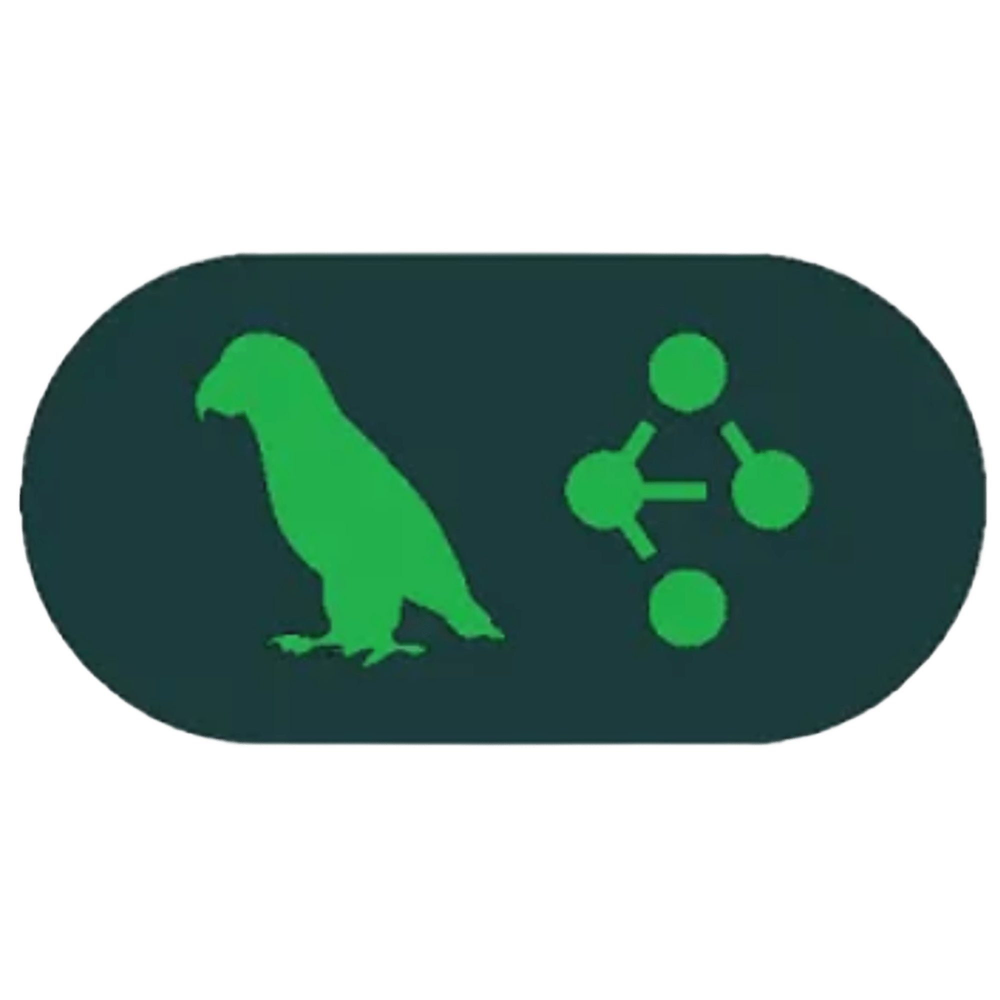

  <h1><b>Heylo, I'm Sanam!</b></h1>
  
<b>Co-Founder <a href="https://xtratum.in" title="View company website">Xtratum Digital</a> &nbsp;&nbsp;|&nbsp;&nbsp; AI & Data Science Enthusiast</b>

  
  

    
    &nbsp;&nbsp;
    
    &nbsp;&nbsp;
    
  

 

I am passionate about building impactful, scalable solutions, with hands-on experience spanning advanced Machine Learning models, Artificial Intelligence, game dev and full-stack dev.
 
 

## **Languages | Tools | DB** 

  
  &nbsp;
  
  &nbsp;
  
  &nbsp;
  
  &nbsp;
  
  &nbsp;
  
  &nbsp;
  
  
  
  &nbsp;
  
  &nbsp;
  
  &nbsp;
  
  &nbsp;
  
  &nbsp;
  
  &nbsp;
  
  &nbsp;
  
  &nbsp;
  
  &nbsp;
  
  &nbsp;
  
  &nbsp;
  
  &nbsp;
  

&nbsp;

